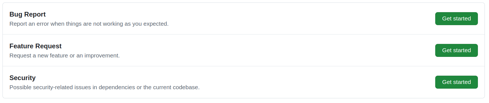
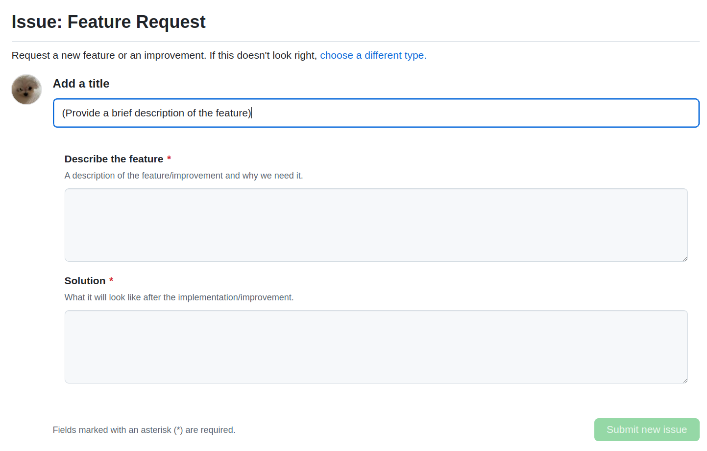

# Contributing Guide
We encourage everyone to get involved in any stage of contribution. We appreciate every contribution no matter how small it is and you don't have to be an expert to become a contributor. Think of this guide as a starting point. Also, please refer to the [community guidelines](community_guidelines.md) before making a contribution. 

## Using `Discussions`
If you are not a developer and need help implementing a new feature or getting a bug fixed, use [discussions](getting_help.md) page to start a discussion. A new discussion will turn into an issue and be assigned to those who wish to resolve or to one of our developers if there's no participant.

## Using `Issues`
Before you begin, please make sure if someone else is already working on the same issue or your issue has already been resolved and waiting to be merged on the upcoming PR to save your time and effort in filing an issue. The following serves as a guide for a first-timer.

1. Visit the `issues` on the top menu bar.

2. Choose an issue category you see fit for your contribution. With each category comes a corresponding template. If you are unsure of how to fill out the template, refer to the closed issues with the same category to get a hint.

3. Fill out the form and click the submit new issue button on the bottom right corner.

We are looking forward to your contributions. Thank you.