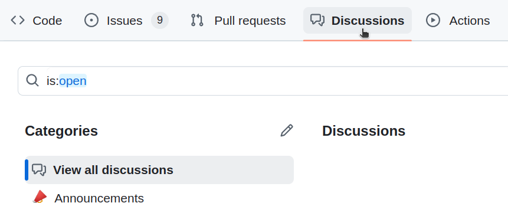

# Contributing Guide
Contributions to the Radius Sequencer project are welcome and greatly appreciated! Whether you are reporting a bug, suggesting new features, improving documentation, or contributing code, your help is vital to making Radius even better. Every contribution is valuable no matter how small it is and you don't have to be an expert to become a contributor. Also, please refer to the [community guidelines](community_guidelines.md) before making a contribution. 

## Using "Issues"
Before you begin, please make sure if someone else is already working on the same issue or your issue has already been resolved and waiting to be merged on the upcoming PR to save your time and effort in filing an issue. The following serves as a guide for a first-timer.

1. Visit the GitHub issues page to create a new issue.

2. Select the appropriate issue template. 

3. Provide a detailed description of the issue. Include any relevant information such as reproduction steps (for bugs), expected behavior, screenshots/logs, and environment details. Submit the issue and wait for feedback or approval from maintainers before proceeding with your changes.

4. Fork the Repository: Start by forking the repository to your own GitHub account. 

5. Clone Your Fork: Clone the forked repository to your local development environment. 

6. Create a Branch: Create a new branch for your feature or bugfix.

7. Make Your Changes: Implement your changes, whether it’s fixing a bug, adding a new feature, or improving documentation. 

8. Run Tests: Ensure all tests pass after your changes. 

9. Commit and Push: Commit your changes with a clear and concise commit message. 

10. Create a Pull Request: Navigate to the original repository and create a pull request. Provide a detailed explanation of the changes made.

At first, it looks complicated because we have broken it down to multiple steps, but don't get discouraged. Once you get used to it, it will be all fun.

## Using "Discussions"
If you are not a developer and need help implementing a new feature or getting a bug fixed, use github discussions page to start a discussion.

A new discussion will turn into an issue and be assigned to those who wish to resolve or to one of our developers if there's no participant.