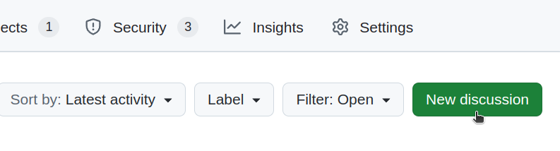
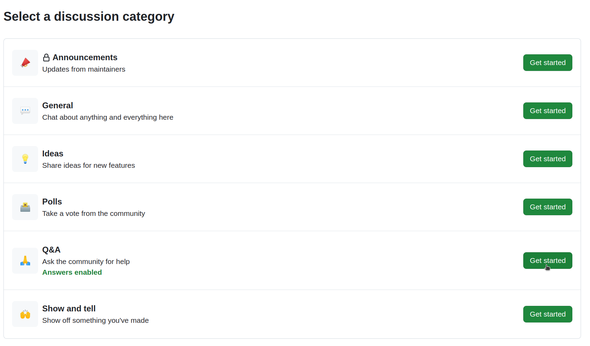

# Getting Help
Feel free to ask any questions or suggest an idea for the project using Github discussion page or via [Telegram chat] if you value privacy. You don't have to be a developer to share your amazing ideas. Also, please refer to the [community guidelines](community_guidelines.md) before you start a discussion. Thank you.

## 1. Visit `Discussions` page on the top navigation bar.

## 2. Click `New discussions` button on the top right corner.

## 3. Choose `Q&A` category and ask your question.

